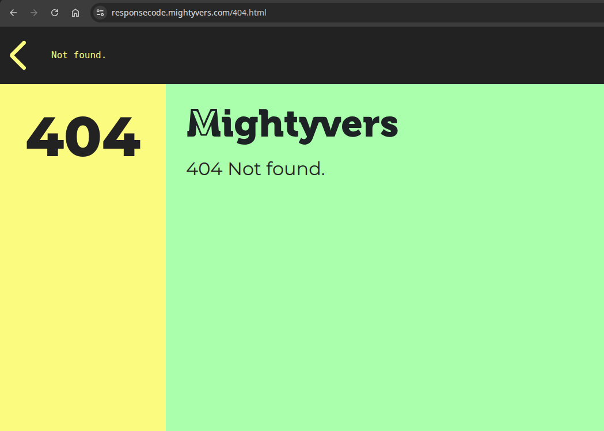

[](https://www.mightyvers.com)
# Response Code

A lightweight, framework-free static website generator for creating beautiful HTTP error pages, maintenance pages, status pages, and response code documentation.

Built with:

* Nunjucks
* SCSS (Sass)
* Live Server
* Zero frontend frameworks
* Mobile-first responsive design


## Start and build

```sh

# set your node version 
nvm use 24 
## install all dev deps
npm i

# start dev server and watch
npm run dev

# optimized production ready
npm run build:prod

```


## Demo

[https://responsecode.mightyvers.com](https://responsecode.mightyvers.com)



---

## Why ResponseCode?

Most error pages are either:

* Plain server-generated responses
* Difficult to customize
* Tightly coupled to a frontend framework
* Over-engineered for simple deployments

ResponseCode provides a clean and maintainable solution for creating professional response and status pages without introducing unnecessary dependencies.

The project generates static HTML files that can be deployed anywhere on:


* Nginx custom error pages
* Apache error pages
* Cloudflare Pages
* GitHub Pages
* Static hosting providers
* Internal documentation portals
* Service status dashboards

---

## Features

### Static HTML Output

All templates are compiled into plain HTML files.

No runtime dependencies.

No JavaScript required.

---

### Nunjucks Templating

Shared layouts and reusable components.

Examples:

* Headers
* Footers
* Navigation
* Error cards
* Backgrounds
* Status blocks

---

### SCSS Architecture

Organized styling structure:

```txt
src/

    scss/
    ├── base/
    │   ├── _variables.scss
    │   ├── _reset.scss
    │   ├── _typography.scss
    │   └── _layout.scss
    │
    ├── components/
    │   └── _code.scss
    │
    └── main.scss

```

---

### Responsive Layout

Desktop:

```txt
+-------------------------+
| Navigation              |
+-----------+-------------+
| Sidebar   | Content     |
| 30%       | 70%         |
+-----------+-------------+
| Footer                  |
+-------------------------+
```

Mobile:

```txt
+-------------+
| Navigation  |
+-------------+
| Content     |
+-------------+
| Sidebar     |
+-------------+
| Footer      |
+-------------+
```

---

### Typography

Optimized for readability.

Fonts:

* Poppins (Body)
* Montserrat (Headings)

Supported content:

* h1
* h2
* h3
* p
* pre
* code

---

### Design System

Palette:

```scss
$bright: #ffef88;
$green: #bffcb1;
$orange: #d77003;
$white: #ffffff;
$black: #222222;
```

---

## Project Structure

```txt
project/

    src/
        ├── templates/
        │   ├── layouts/
        │   ├── pages/
        │   └── partials/
        │
        ├── scss/
        │   ├── base/
        │   └── components/
        │
    ├── dist/
    │
    ├── build.js
    ├── package.json
    └── README.md
```

---

## Development

Start the development server:

```bash
npm run dev
```

This will:

1. Build all HTML templates
2. Compile SCSS
3. Watch template changes
4. Watch SCSS changes
5. Start a local web server

---

## Production Build

Generate optimized output:

```bash
npm run build
```

Generated files are written to:

```txt
dist/
```

---

## Use Cases

### HTTP Error Pages

Examples:

* 400 Bad Request
* 401 Unauthorized
* 403 Forbidden
* 404 Not Found  (available)
* 429 Too Many Requests
* 500 Internal Server Error  (available)
* 502 Bad Gateway
* 503 Service Unavailable  (available)

- and any others can be set
---

### Maintenance Pages

Useful during:

* Infrastructure upgrades
* Scheduled maintenance
* Service migrations
* Platform deployments

---

### Status Pages

Create lightweight status dashboards without requiring external services.

Examples:

* API status
* Service availability
* Operational notices
* Incident communication

---

### Internal Documentation

The layout and typography system can also be used for:

* Documentation portals
* Knowledge bases
* Technical references
* API documentation

---

## Why Not Use a Framework?

This project intentionally avoids:

* React
* Vue
* Angular
* Next.js
* Nuxt
* Astro

Benefits:

* Faster builds
* Simpler deployment
* Lower maintenance
* No hydration overhead
* Minimal dependencies
* Easier long-term ownership

---

## Philosophy

Keep it simple.

Generate static files.

Deploy anywhere.


---

## Build By

**MightyVers Software**

Building reliable software solutions, developer tooling, automation systems, infrastructure platforms, and modern web experiences.

## Contact us

Connect with us at [MightyVers Software](https://www.mightyvers.com/connect)

Website: [https://www.mightyvers.com](https://www.mightyvers.com)


## License

This project is released under the MIT License.

Copyright (c) 2026 MightyVers Software.

<br/>
<br/>